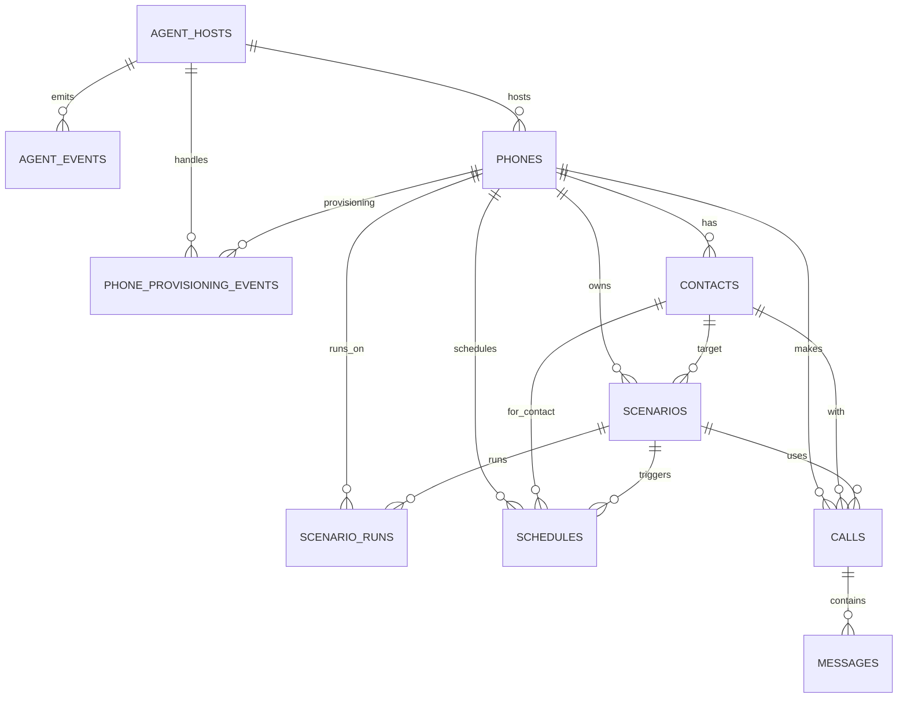

# Architecture: Agent Updates DB, FastAPI Pulls Status

## Overview

בארכיטקטורה זו:

- **Agent** אחראי על runtime של הטלפון וה-containers
- **Agent מעדכן את ה-DB ישירות**
- **FastAPI משמש Orchestrator ו-API ל-UI**
- **React UI פונה רק ל-FastAPI**
- **FastAPI קורא את ה-DB כדי להחזיר סטטוס**

אין צורך ב-queue או events bus.

---

# High Level Architecture

## Database ER Diagram

